# เอกสารข้อกำหนดทางซอฟต์แวร์ (SRS) - ระบบจัดการการลาพนักงาน EdVISORY

## 1️⃣ บทนำ
**ชื่อโครงการ**: ระบบจัดการการลาพนักงาน EdVISORY (Employee Leave Management System - EdLeave)  
**วันที่จัดทำ**: 13 มีนาคม 2025  
**ผู้รับผิดชอบ**: อนันดา วุฒวรรรณะ  

เอกสารข้อกำหนดทางซอฟต์แวร์ (Software Requirement Specification - SRS) นี้ใช้เพื่อกำหนดรายละเอียดของระบบจัดการการลาพนักงาน EdVISORY หรือ "Employee Leave Management System" (EdLeave) รวมถึงคุณสมบัติ ฟังก์ชันการทำงาน และข้อกำหนดที่จำเป็นสำหรับการพัฒนาโครงการ

---

## 2️⃣ วัตถุประสงค์ของระบบ
1. เพื่อให้พนักงานบันทึกการลาให้เป็นไปตามนโยบายที่บริษัทกำหนดไว้ได้อย่างถูกต้อง
2. เพื่อให้พนักงานสามารถเช็คโควต้าวันลาที่เหลือของตนเองได้ด้วยตนเอง
3. เพื่อสร้างระบบอนุมัติการลาที่เป็นลำดับขั้นตอนชัดเจนตามนโยบายขององค์กร

---

## 3️⃣ ขอบเขตของระบบ
### ✅ ฟังก์ชันที่รองรับ
- การตรวจสอบโควต้าวันลาคงเหลือสำหรับแต่ละประเภทการลา
- การยื่นใบลาด้วยรูปแบบที่หลากหลาย (ครึ่งวันเช้า, ครึ่งวันบ่าย, เต็มวัน)
- การยื่นใบลาในประเภทต่างๆ (ลาป่วย, ลากิจ, ลาพักร้อน)
- ระบบการอนุมัติตามลำดับขั้นที่แตกต่างกันขึ้นอยู่กับระยะเวลาการลา
- การแจ้งเตือนและการติดตามสถานะการลา

### ❌ ข้อจำกัดของระบบ
- ระบบไม่รองรับการอนุมัติข้ามลำดับ และการอนุมัติย้อนหลัง (ต้องดำเนินการตามลำดับเท่านั้น)

---

## 4️⃣ ผู้ใช้เป้าหมายและบทบาท
| ประเภทผู้ใช้ | คำอธิบาย | บทบาทในระบบ |
|-------------|---------|------------|
| พนักงาน | พนักงานทุกคนในองค์กร | - ตรวจสอบโควต้าวันลาคงเหลือ - ยื่นคำขอลา - ติดตามสถานะการลา |
| Supervisor (ผู้ดูแล) | หัวหน้างานที่ดูแลพนักงานโดยตรง | - ดูข้อมูลการลาของพนักงานในทีม - อนุมัติ/ปฏิเสธคำขอลา 
| หัวหน้าแผนก | ผู้บริหารระดับกลางที่ดูแลแผนก | - ดูข้อมูลการลาของพนักงานในแผนก - อนุมัติ/ปฏิเสธคำขอลาที่เกิน 5 วัน 
| ฝ่าย HR | ทีมงานบริหารทรัพยากรบุคคล | - ดูข้อมูลการลาของพนักงานทั้งหมด - อนุมัติ/ปฏิเสธคำขอลาทุกประเภท - จัดการโควต้าวันลา 

---

## 5️⃣ ข้อกำหนดทางฟังก์ชัน (Functional Requirements)
| รหัส | รายละเอียดข้อกำหนด |
|------|----------------|
| FR-001 | ระบบให้พนักงานสามารถตรวจสอบจำนวนวันลาคงเหลือของแต่ละประเภท (ลาป่วย, ลากิจ, ลาพักร้อน) |
| FR-002 | ระบบให้พนักงานสามารถยื่นใบลาโดยระบุประเภทการลาได้ 3 แบบ (ลาป่วย, ลากิจ, ลาพักร้อน) |
| FR-003 | ระบบให้พนักงานสามารถเลือกรูปแบบระยะเวลาการลาได้ 3 แบบ (ครึ่งวันเช้า, ครึ่งวันบ่าย, เต็มวัน) |
| FR-004 | ระบบต้องส่งคำขอลาของพนักงานไปยัง Supervisor และฝ่าย HR เพื่อพิจารณาอนุมัติ |
| FR-005 | ในกรณีที่การลาติดต่อกันตั้งแต่ 5 วันขึ้นไป ระบบต้องส่งคำขอลาของพนักงานไปยัง Supervisor , หัวหน้าแผนก และฝ่าย HR ตามลำดับ |
| FR-006 | ระบบต้องอนุญาตให้ Supervisor, หัวหน้าแผนก และฝ่าย HR สามารถอนุมัติ/ปฏิเสธคำขอลาได้ |
| FR-007 | ระบบต้องอัพเดทโควต้าวันลาของพนักงานโดยอัตโนมัติเมื่อมีการอนุมัติคำขอลา |
| FR-008 | ระบบต้องอนุญาตให้ฝ่าย HR สามารถจัดการโควต้าวันลาของพนักงานแต่ละคนได้ |
| FR-009 | ระบบต้องส่งการแจ้งเตือนไปยังพนักงานเมื่อมีการอัพเดทสถานะคำขอลา
| FR-010 | ระบบต้องมีฟิลด์ให้พนักงานระบุเหตุผลในการลาเพื่อประกอบการพิจารณา |
| FR-011 | ระบบต้องมีฟิลด์ให้ผู้อนุมัติ (Supervisor, หัวหน้าแผนก, HR) ระบุเหตุผลเมื่อปฏิเสธคำขอลา |
---

## 6️⃣ ข้อกำหนดที่ไม่ใช่ฟังก์ชัน (Non-Functional Requirements)
### ประสิทธิภาพ (Performance)
- ระบบต้องสามารถรองรับการใช้งานพร้อมกันของพนักงานทั้งองค์กรได้

### ความปลอดภัย (Security)
- ข้อมูลการลาของพนักงานต้องถูกเข้ารหัสในฐานข้อมูล
- การเข้าถึงข้อมูลต้องถูกจำกัดตามบทบาทของผู้ใช้งาน

### ความเสถียร (Reliability)
- ระบบต้องพร้อมใช้งานได้ตลอด 24 ชั่วโมง ทุกวัน 
- ระบบต้องมีการสำรองข้อมูลอัตโนมัติทุกวัน

### ความสามารถในการใช้งาน (Usability)
- ส่วนต่อประสานกับผู้ใช้ (UI) ต้องเรียบง่าย เข้าใจง่าย

### ความสามารถในการขยายระบบ (Scalability)
- ระบบต้องรองรับการเพิ่มเติมประเภทการลาในอนาคตได้
- การรายงานและการวิเคราะห์ข้อมูลการลา

---

## 7️⃣ แผนผังและสถาปัตยกรรมระบบ

### Use Case Diagram

### Activity Diagram

### ER Diagram

### System Architecture

---

## 8️⃣ เทคโนโลยีและเครื่องมือที่ใช้
| ประเภท | รายละเอียด |
|--------|----------|
| Backend | Node.js with Express.js |
| Frontend | React.js (Web)|
| Notification | Firebase Cloud Messaging |
| Database | PostgreSQL |
| Authentication | JWT (JSON Web Tokens) |
| DevOps | Docker|
| Cloud | AWS (Amazon Web Services) |
| CI/CD | GitLab CI/CD |

---

## 9️⃣ สมมติฐานและข้อจำกัด
### สมมติฐาน
- พนักงานทุกคนมีอีเมลของบริษัทและสามารถเข้าถึงระบบได้
- ผู้ใช้งานมีความเข้าใจพื้นฐานในการใช้งานแอปพลิเคชันเว็บ
- โครงสร้างองค์กรและลำดับขั้นการอนุมัติมีความชัดเจน

### ข้อจำกัด
- การอัปเดทโควต้าวันลาประจำปีจะต้องดำเนินการโดยฝ่าย HR

---

📌 **หมายเหตุ**: เอกสารนี้อาจมีการเปลี่ยนแปลงและปรับปรุงตามการพัฒนาของโครงการ